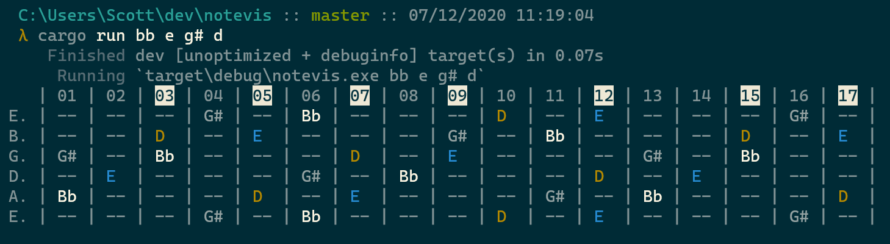

# NoteVis

Plot out all the different permuatations of a given set of notes on a fretboard

* supports sharps vs flats
* adds inlay highlights for easier visualization
* adds unique color to each note for easier visualization

## TODO

* support different string tunings
* support more string counts
* support variable fret ranges
* toggle color on/off
* variable color palettes
