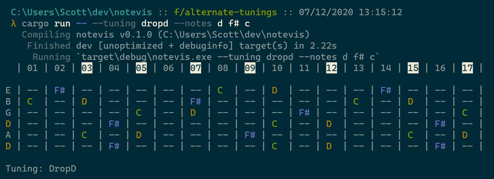
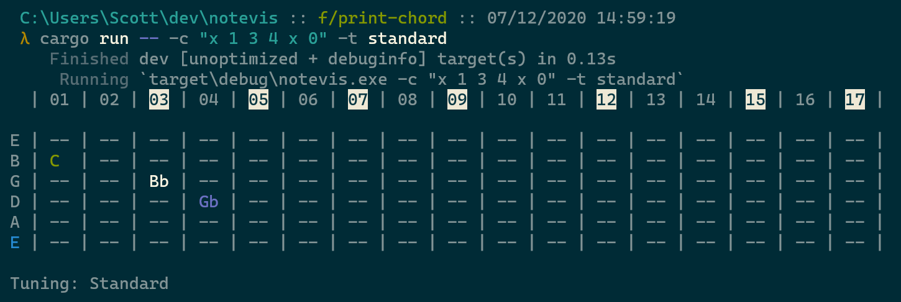

# NoteVis

A tool to help visualize musical notes on a fret board. Currently two modes are supported:

1. **Note-to-fret**: Given a tuning and set of notes, print all occurences of that set of notes on the fretboard.
 
2. **Fret-to-note**: Given a tuning and set of frets, print the notes corresponding to that set of frets overlayed on the fretboard.
 

Both modes support the following:
* supports sharps vs flats
* adds inlay highlights for easier visualization
* adds unique color to each note for easier visualization
* supports alternate tunings

## TODO

* support more string counts
* support variable fret ranges
* toggle color on/off
* variable color palettes
